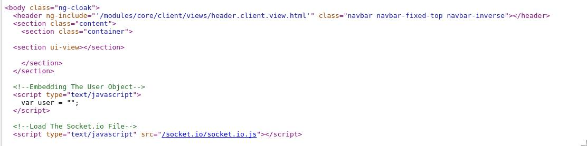

# Angular.JS-server  [](https://travis-ci.org/a-lucas/angular.js-server)

## Introduction

<!--Official site: https://a-lucas.github.io/angular.js-server/-->

[Angular.js](https://angularjs.org/ "A super hero framework")  is a super heroic framework originally designed for web apps development. It usage has quickly expanded for hybrid mobile application development, with one mojo: one language to rule it all.
  
The only missing piece is server-side rendering, which this package aims to fix. 

What does server side rendering means for angular?


- You don't have to modify your existing Angular.js code base.
- You can have big SEO benefits
- Your website will behave as a web application - which means a much richer UX.
- You get huge performances benefits by server side caching REST API and templateCache and replay them in your client instantly on page load
- You can start developing your website with Angular, server side render it, and later port it into a mobile app with [cordova]()

<!--
[//]: # ##Comparing server prerendering with no prerendering

[//]: # 
[//]: # **MEAN.js HTML with Angular.js**

[//]: # 
[//]: # **MEAN.js HTML with Angular.js-server**

[//]: # You can check this out by yourself at this url: https://github.com/a-lucas/mean
-->
## How does it works?

This library uses [JSDOM](https://github.com/tmpvar/jsdom) to execute the angular app in a browser like environment on the server, [simple-url-cache](https://www.npmjs.com/package/simple-url-cache) to handle the url caching and [angular.js-server client library](https://github.com/a-lucas/angular.js-server-bower) to link this all together.

To explain what is going on under the hood, let's use a todo case scenario and compare it with angular-server's flow.

## Usual flow

1. The  browser request `/Todo`
2. The server receives the request and sends back the HTML ( which doesnt't have much body, the ng-app loads it asynchronously )
3. The client receives the HTML, loads all the JS scripts and then bootstrap angular, resolving the route and $http'ing all the needed templates 
4. Once bootstrapped ng-app sends a $http request back to the server for a todo list
5. The server sends back a json list.we'll call it  **json-time**, and all the html templates, which we call **templates[]**
6. Then angular displays the todo list on screen

*At this stage, the HTML you have in the web inspector is what ng-server aims for.*
We'll call it **GoalHTML**.

## Angular.js-server's flow

1. The browser request `/Todo`
2. The server receives and ask : **Should `/Todo` be rendered ?**
    - *(yes)*
        - **Is Caching enabled?**
            - *(yes)*
                - **Is Todo already cached?**
                    - *(no)*
                        - -> pre-render on server the app and get **GoalHTML** ready to be sent
                        - -> cache the **GoalHTML** for subsequent calls
                        - **Is REST caching enabled?**
                            - *(yes)*
                                - -> cache **json-time**
                                - -> cache **templates[]**                                    
                    - *(yes)*
                        - -> Retrieve **GoalHTML** , **json-time** and **templates[]**
            - *(no)*
                - pre-render on server the app and get **GoalHTML** ready to be sent            
        - Sends back **GoalHTML** + **json-time** + **templates[]** embeded for an instant replay on the client
    - *(no)*
        - -> Return the vanilla HTML.

>> Note: All logging and error handling have been skipped for padding purposes

## Getting started

Choose what you want to pre-render and what you want to cache
    
    ```javascript
    vae ngServer = require('angular.js-server');
    var server = new ngServer();
    //by default, rendering is off, and caching off
    server.config.render.setDefault('include'); //never, include, exclude
    server.config.render.addRule(/^index\.html$/);
    
    app.get('/index.html', function(req, res) {
        var html = fs.readFileSYnc(..., 'utf-8');
        server.render(html, req.url).then(function(response){
            res.send(response.html);
        }, function(result) {
            // if any error, send the original html
            res.send(response.html);
        });
    }
    
    //or with a middleware
    
    app.get('index.html', server.middleware(), function(req, res, next) {
        res.render('/var/content/index.html');
    }
    ```

**Response format**

```typescript

interface IResponse {
    html: string,
    status: string,
    code: number,
    stacktrace: any
}

```

**Status, error codes and resolve/reject**

`server.render` returns a promise, either fullfilled or rejected.

| Fullfilled | Rejected | Rejection Details |
| --- | --- | --- |
|0 : RENDERED|3 : SERVER_TIMEOUT | `server.config.setTimout(10000)` |
|1 : RENDER_EXCLUDED | 4 : ERROR_HANDLER | Angular $exceptionHandler decorator |
|2 :  ALREADY_CACHED | 5 : SERVER_ERROR | |
|  | 6 : JSDOM_ERROR | JSdom crashed probably because of bad content |
|  | 7  : JSDOM_URL_ERROR | JsDom can't retreieve a uRL |


## Config

Angular-server has severall config options :
 
- **ServerConfig**
    Sets the domain name, port, base url, timeout and debug
- **RenderConfig**
    Add and remove Regex rules, and set up the render strategy to adopt. 
- **LogConfig**
    All your client log is written on the server, here you setup the base dir, server log, and fine tune each of [warn, info, log, debug and error]'s behavior. 
- **CacheConfig** and **RestCacheConfig**
    They both share the same class definition. Add/Get/Remove caching rules, clear cache. 

> All these config objects are passed by reference and are public. 

## Config API

Check the `docs` folder.

## Dependencies

This library depends on a compatible version of [Angular.js-server client](https://github.com/a-lucas/angular.js-server-bower "Angular.js-server")

[](https://travis-ci.org/a-lucas/angular.js-server-bower)   [](https://codecov.io/gh/a-lucas/angular.js-server-bower)

## Requirements

**html5mode**

Your angular app must use [html5mode](). The reason behind this requirement is that browsers don't send the hashbang fragment to the server.

**Angular.js 1.5.x**

This has been written with 1.5.x in mind.

**node.js**

The only known way to integrate node with popular server side technologies as (PHP, Perl, ASP, whatever) is to summon node.js child processes to do the work. 

## Functionalities

**Web page caching**

It is possible to cache the files on the file system, or in a [Redis]() datastore. If you need to use another storage engine, you can extend [simple-url-cache]() package to meet your needs.

**REST $http caching & angular template pre-caching**

When pre-rendered, every templateRequest and REST call can be optionally cached and injected into the client before the angular app bootstraps. These requests are instantly replayed, decreasing considerably the client page loading time.
REST and template caching is shared between angular instances.

**URL filtering**

You can decide which URLs will be pre-rendered, and uses either of the two strategies `include` or `exclude` by providing an array of Regexes to match URL against.

**Logging** 

The `$logProvider` is augmented in the client to access the file system when rendered on the server. It becomes then possible to log anything your web-app does on the server file system.

## Installation

### Client Side library

You can install [it](https://github.com/a-lucas/angular.js-server-bower) vith bower. 

```bash
bower install angular.js-server
```

For those without bower, this is [where the file is](https://github.com/a-lucas/angular.js-server-bower/tree/master/dist)

Then you need to include the module `server` as a dependency in your AngularJS application.

### Server module installation

```bash
npm install angular.js-server
```

## Under the hood

The [server module](https://github.com/a-lucas/angular.js-server-bower) augments the global window injecting some usefull functionalities accessible only when executed server side: 
 - `Idle` Event and `ServerExceptionHandler` that notifies the server of app's status
 - A decorated `$cacheFactory` that handles importation of http responses
 - A httpInterceptor that checks for cached REST requests
 - A decorated `$logProvider` that handles all the server side logging
  
#WIP

This work is incomplete and in progress - DON'T use it on prod withouth prior testing.