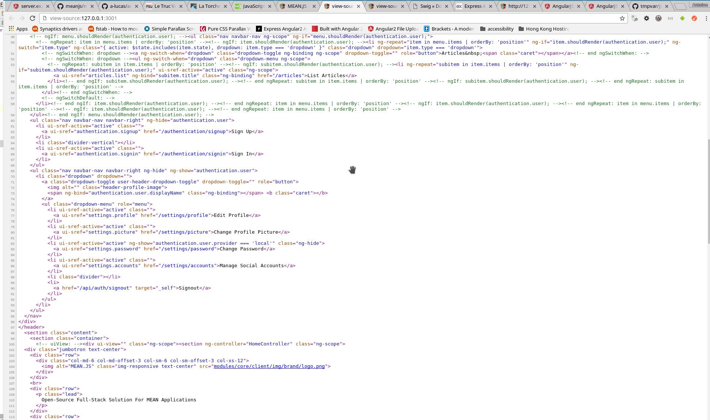

# ng1-server  

This is a server side rendering engine for Angular 1. For Angular2+, you may look at [Angular universal](https://universal.angular.io/),

[](https://travis-ci.org/ng-consult/ng1-server)  
[](https://codecov.io/gh/ng-consult/ng1-server)

## Introduction

<!--Official site: https://a-lucas.github.io/angular.js-server/-->

> A port of this server to Angular2 is not on the roadmap - but it is technically possible to adapt ng1-server-bower for angular2+.

[Angular.js](https://angularjs.org/ "A super hero framework") is a super heroic framework originally designed for web apps development. It usage has quickly expanded for hybrid mobile application development, with one mojo: one language to rule it all.
  
The only missing piece is server-side rendering, which this package aims to fix. 

What does server side rendering means for angular?

- You don't have to modify your existing Angular.js code base.
- You can have big SEO benefits
- You get support for REST caching out of the box
- Your website will behave as a web application - which means a much richer UX.
- You get huge performances benefits by server side caching REST API and templateCache and replay them in your client instantly on page load
- You can start developing your website with Angular, server side render it, and later port it into a mobile app with [cordova]()


##Comparing server pre-rendering with no pre-rendering


**MEAN.js HTML with Angular.js**


**MEAN.js HTML with Angular.js-server**

## Getting started

### Pre-requirement

First install ng1-server globally, firefox and xvfb

```bash
# Dependencies
sudo apt-get install firefox xvfb git

npm install -g ng1-server
```

Then install the angular client side ng-server module: 

```bash
bower install --save ng1-server
```

You will also need to have a [Redis](https://redis.io/) server available.

***html5mode***

Your angular app must use [html5mode](https://docs.angularjs.org/guide/$location). The reason behind this requirement is that browsers don't send the hashbang fragment to the server.

***Angular.js 1.5.x***

This has been written with 1.5.x in mind - but it should work with 1.3+ .


### Client configuration

Include the `server` module into your web-app.

```javascript
angular.module('your-app',['server']);
```

You will then have to define a global `serverConfig` variable for the client app.

```javascript

var serverConfig = {
    clientTimeoutValue: number,
    debug: boolean,
    httpCache: boolean,
    restCache: boolean,    
    restServerURL: string
}

```

**clientTimeoutValue** *default = 200*
 
You shouldn't have to change/set this setting. It is used by the client to trigger the IDLE status of the app. Once a potential IDLE status is detected, it will check again in 200ms if the app status has changed since then. If no, then this is an IDLE.

**debug** *default = false*

Turns the `$log.dev` on the client. 

**httpCache** *default = false*

After the client replays all the $http calls, set $http.cache to this value.

**restCache** *default = false*

Enables the REST caching functionality. Every  $http call will be going trough the `restServerURL`. 
 
**restServerURL** *default = null*

If `restCacheEnabled`, this setting is required. The restServerURL will proxy all $http request, and will cache them according to the `slimerRestCacheRules.yml` rules.


### ng-server configuration

Create a folder `configYaml` inside your webapp folder, and copy paste the content of [bin/configYaml](/bin/configYaml) inside it.

Modify the config files at your wish, then start the server passing the absolute path to your `configYaml ` folder: 

```bash
ng1-server PATH-TO-configYaml
```


####serverConfig.yml

```yaml
domain: 'http://localhost:3000'
timeout: 10
preboot: false
logBasePath: '/logs'
gelf:
 enabled: true
 host: '127.0.0.1'
 port: 12203
socketServers:
 bridge_external:
   protocol: 'http://'
   host: '127.0.0.1'
   port: 8881
 bridge_internal:
   protocol: 'http://'
   host: '127.0.0.1'
   port: 8882
 proxy:
   protocol: 'http://'
   host: '127.0.0.1'
   port: 8883
redisConfig:
 host: '127.0.0.1'
 port: 6379
 socket_keepalive: true

```

**domain** 

Your webapp domain name (including the port)

**timeout**

Number in seconds after the server rendering will be considered as timed out.

**preboot**

Enables [preboot](https://github.com/angular/preboot) support

**logbasePath**

Path where all server side log file will be stored. It will attempt to create them under `/` first. If failed, it will use the relative path from where the server is launched.

**gelf**

Turns [Graylog](https://www.graylog.org/) logging on.

**socketServers**

Defines all server addresses
> ng1-server  launches all 3 servers on different ports, make sure these are available.

**redisConfig**

Information about your redis server.

####serverRenderRules.yml

Tells the server which URL it should pre-render. Those not pre-rendered will return the original HTML.

`strategy` is `always` or `never`
`rules[]` contains a list of Regexes. If strategy is always, then every URL matching this list will be pre-rendered. Otherwise they will be ignored. 

Example 1: pre-render every URLs.

```yaml
strategy: 'always'
rules: []
```

Example 2: pre-render only URLS ending with `.html`.

```yaml
strategy: 'always'
rules: 
    - /.*\.html$/   
```


Example 3: pre-render everything execpt URLS containing `user`.

```yaml
strategy: 'never'
rules: 
    - /user/   
```


####serverCacheRules.yml 

Now the URL is pre-rendered, should the server cache this HTML for next time?

####slimerRestCacheRules.yml

Configures what dependencies / REST url will be cached.

*ex1:* Scripts dependencies, want to cache all calls to angular-ui ? angular-material? your sources? This is recommended because this will greatly improves the pre-rendering speed.

*ex2:* Some $http rest calls are known to be static? Some other changes once in a while? You can cache them too !

Both `serverCacheRules.yml` and `slimerRestCacheRules.yml` files format specification follows [redis-url-cache config file format](https://ng-consult.github.io/redis-url-cache/api.html#config.cache-rules).

## How does it works?

It is composed by 5 main components, 

###The Client

By design, it can be platform independent, language independent. This is a simple websocket client that queries the rendering server (Bridge) for an url or an url+html. 
It gets notified in real time by **the bridge** about the status of the query.

###The Bridge

The Bridge has two socket servers listening on two different ports. First port is dedicated for external communications with the **client**. 
The second port is dedicated to internal communications with **the Angular client module (ng1-server-bower)**.

- Listen and updates the **the client** in real time as soon something new happens( queues, starting, finished, error).
- Spawns and manage the internal pool of **slimer.js instances**.
- Once the web-app launches inside slimer, listen socket requests from **the ng1-server client module** about logging and application state (`error` | `idle`)        

###The slimer.JS instances

Each pre-rendering is made via slimer.js which is similar to phantom.js. It simulates a real web-browser environment, and execute the URL/HTML.

- Communicates with it parent's process trough websocket, sending runtimes informations
- Intercept every network communication ( `<script>` loading, '$http' calls, and forward them to the **cache  web server**.
- Makes sure no zombie are left behind
- Handles runtimes error

###The ng1-Server-bower client module

This module is included inside the angular web-app and modifies several providers to adapt with the server side environment.

*When running on server:*

- Forwards all $log calls to **the bridge**
- When detecting the IDLE event, it sends the rendered HTML to the **bridge** AND exports the `$cacheFactory`'s content to **the bridge**
    
*When running on the client's browser:*

- Replays the `$cacheFactory` content for faster client side rendering
- If enabled, forward all `$http` calls to the **cache web server**
    
###A Cache Web Server

The cache server is a custom proxy/cdn that will cache urls depending on regex rules you specify in the config file `slimerRestCacheRules.yaml`
It is used by **the slimmer.js instances** and **the ng1-server-bower angualr module**

         
## Beta

This is a beta, and it is still WIP.
What need to be done before reaching stable release is : 

- All cases for e2e testing have to be implemented [Documented here](test/README.md)
- Packaging the server into `.deb`, `.rpm`, `mac os` and windows `.exe` binaries ( possible with [nexe](https://github.com/nexe) ) 


## Test

Simply run `npm run test` or [check the travis output](https://travis-ci.org/ng-consult/ng1-server)

The web app used to run the tests [can be found here](https://github.com/a-lucas/angular.js-server-test-client). This app needs to get updated to support testing of

- cookies
- authentication
- preboot

## Main dependencies

- [Bunyan](https://github.com/trentm/node-bunyan) to log server related metrics and web app behavior. It also integrates with [Graylog](https://www.graylog.org/)
- [Ng1-server client library](https://github.com/ng-consult/ng1-server-bower) to link this all together.
- [Preboot](https://github.com/angular/preboot) to manage the transition of state (i.e. events, focus, data) from a server-generated web view to a client-generated web view.
- [Redis Url Cache](https://www.npmjs.com/package/redis-url-cache) to handle the url caching and 
- [Slimer.JS](https://slimerjs.org/) to execute the angular app in a browser like environment on the server, 
- [Socket-io](http://socket.io/) to establish communication between the application modules. 

## Clients

So far, only one client [ng1-server-node-client](https://github.com/ng-consult/ng1-server-node-client) is implemented.

Install it by running `npm install --save ng1-server-node-client` inside your web server project.
 
The client connects to the ngServer port specified in the config.
```
var Client = require('ng1-server-node-client`);

#http://127.0.0.1:8881 is the Bridge_external url defined inside your serverConfig.yaml

var client = new Client('http://127.0.0.1:8881');

client.renderURL(url, function( response ) {
    
});


client.renderHTML(url, html, function( response ) {
    
});

```


For more information, check  [ng1-server-node-client](https://github.com/ng-consult/ng1-server-node-client) 's README.
 
 
##Logging


### File logging

ngServer uses Bunyan to log useful information and any errors raised.

The following log files are created, depending on the value of `serverConfig.logBasePath`: 

```bash

cd $logBasePath
ls

# Server logs
trace.log
info.log
error.log

# Web application logs triggered with angular's $log
web-app.log
web-app-errors.log

```


### GrayLog 
 
 You can forward all these logs to a GrayLog server by changing the config `serverConfig.gelf`. Note that the input must be UDP. 

# Contributing
 
Contributors are very much welcomed. I currently work full time, and my free time to help with this project can sometimes be very limited.

Also don't hesitate to file issues.
